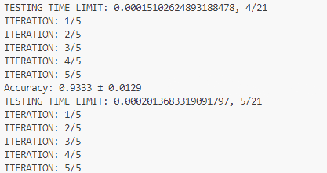
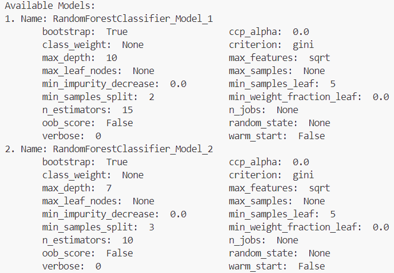
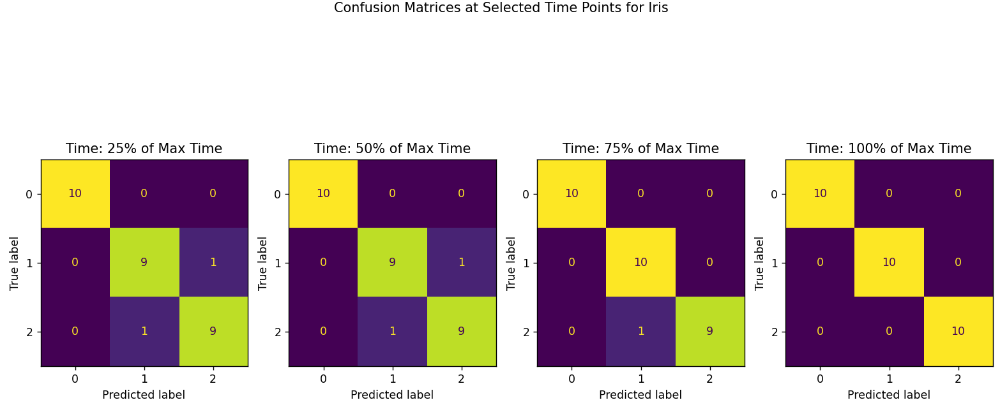

# AnytimeML Suite

The **AnytimeML Suite** is a benchmarking and evaluation framework for machine learning (ML) models designed to be deployed on self-powered IoT devices in resource-constrained environments.

It supports training, evaluating, and visualizing the performance of models, with features such as confusion matrices and various metrics plotted over time.

---

## Features

- **Dynamic Model Evaluation**: Evaluate models under time constraints with metrics like accuracy, precision, recall, and F1-score.
- **Dataset Management**: Add, load, and preprocess datasets easily.
- **Visualization Tools**: Generate plots for:
  - Quality vs. Time
  - Confusion Matrices
  - (Planned) ROC AUC vs. Time
- **Customizable Models**: Train models with user-defined hyperparameters.
- **Support for Binary Classification**: Includes preprocessing for datasets like CIFAR-10 to create binary classification tasks.

---
## Contributors

- Thomas Donnellan, https://github.com/tcdonni76
- Tomasz Szydlo, https://github.com/tszydlo
---


## Table of Contents

1. [Installation](#installation)
2. [Usage](#usage)
    1. [CLI Options](#main-menu-options)
    2. [Training Models](#evaluating-models)
    3. [Adding New Models](#adding-new-models)
    3. [Add new Datasets](#adding-datasets)
    6. [Visualising Results](#visualising-results)
7. [File Structure](#file-structure)
8. [Future Enhancements](#future-enhancements)

---

## Installation

1. Clone the repository:
   ```bash
   git clone https://github.com/your-repo/AnytimeML-Suite.git
   cd AnytimeML-Suite
2. Install the required packages
    ```bash
    pip install -r requirements.txt

## Usage
3. Run the Command Line Interface (CLI) to interact with the suite
    ```bash
    python CLI.py

### Main Menu Options
The CLI gives different options to the user and is the main way to interact with the project. When first ran, it opens the **Main Menu** which provides the following options:
1. **Add a new model**: Add a new model into the current list for evaluation
2. **Train a Model on a dataset**: Select a model and dataset, and generate results at different time intervals used in the visualisations
3. **Display charts for an Existing Model**: Visualise results from option 2. Currently, this generates plots over time for accuracy, recall, precision, and F1, or it plots confusion matrices at different time points.
4. **Exit**: Close the suite

### Evaluating models

To train a model, select option 2 from the [Main Menu](#main-menu-options). When selected the models loaded in from the models.json file are listed as options as seen below:


Each model is listed with full transparency to ensure users fully understand the models that have been included, listed is:
- Model name, listed in a standardised format of MODELTYPE_Model_MODELNUMBER. For more details see [Adding New Models](#adding-new-models)
- Model type: the classifier used, in the current form the suite has RandomForestClassifiers as the models included
- Hyperparameters: different for each type of model, the hyperparameters used by the specific configuration of the model are listed out

Once a specific model is selected, the dataset to test against is then used as seen below:


Once the dataset is selected, the test initiates, as seen below. The maximum time for the evaluation to fully complete is evaluated, and then using this max time the evaluation is checked at 20 even time intervals between 0 and the maximum time. At each time interval, the accuracy and standard deviation of this is printed to give an idea of how the model is performing.



At each time interval, the evaluation is done over 5 iterations and an average of the metrics is taken in order to minimise variations that arise from varying resource allocations by the machine at runtime.

Once all of the time intervals have completed evaluation for every iteration, the results are stored in [results.json](BenchmarkingSuite/results.json) to be used in [Visualising Results](#visualising-results)

### Adding New Models

To add a new model, select option 1 from the [Main Menu](#main-menu-options)

Once selected, The following 3 options are presented


#### Adding a new existing model
When adding a new existing model (such as a RandomForestClassifier) is being added, selected hyperparameters are given as options, then you enter them seperated by commas.


Once entered in the correct format, the new model is stored in [models.json](BenchmarkingSuite/models.json) and then can be selected when [evaluating models](evaluating-models).

#### Adding a custom model
When adding a custom model, there will be a prompt to enter the type of model, and entering the model type will ensure that is stays within the naming convention of **<model_type>\_Model\_<model_number>**.

Once the model type name has been entered, the hyperparameters for this specific configuration can then be entered one by one until you press Enter without any other text. An example of implementing a "test" model can be seen below:


To use your custom model in the [evaluating models](#evaluating-models), you need to add your classifier function to BenchmarkingSuite/Classifiers folder. The format of the name of the file needs to be as follows:

**<DATASET_NAME>_<MODEL_NAME>.py**

(For example, for RandomForestClassifier_Model_2 evaluating the Iris dataset, the name would be Iris_RandomForestClassifier_Model_2.py).

This python file should contain a **classifier** function, which takes in the following inputs:
- x: the sample from the daataset
- results: a list of predictions to use in your algorithm (for instance for RFC it would store predictions performed by each tree)
- deadline: the time budget provided telling the algorithm when to stop its inference
- flag: an interruption flag that to implement "anytime" stopping in a deplyment environment.

And this classifer function should return:
- A tuple of the final prediction and the number of inferences made
- For instance, the RFC classifiers return the prediction voted on in the majority voting mechanism and the number of trees that were processed before the deadline has been reached.

### Adding new datasets
To add a new dataset into the suite, you need to alter the [DataHandler](BenchmarkingSuite/DataHandler.py) class.

First, you need to add in a function to the DataHandler class which handles loading in the dataset you want and any necessary preprocessing steps (such as in the CIFAR-2 dataset the data is subsetted and the classes are simplified to binary classification of vehicles or animals).

Second, you need to alter the load_dataset function to add in the function that you have just created:


Finally, add the name of the dataset (as written in the load_dataset function of the DataHandler) to [datasets.json](BenchmarkingSuite/datasets.json) file.

With these steps, the new dataset will now be available to evaluate the models with using [option 2](#evaluating-models).

### Visualising results
To visualise the results, select option 3 from the [Main Menu](#main-menu-options).

As with [evaluating models](#evaluating-models), once this option is selected, the available models are listed as seen below


Similarly, type the corresponding number of the model to proceed. Then various options are given for different "runs" of the model, through displaying each occurance of the selected model within the [results.json](BenchmarkingSuite/results.json) file, an example can be seen below:


Once a "run" has been selected to analyse, then the user can select the type of plot, and this will continue unilt the user chooses the Back to Main Menu option.

#### Quality vs. time
The Quality vs time plots gives the mean value for precision, recall, F1 and accuracy over the recorded time periods (that is, as mentioned in [evaluating models](#evaluating-models), the 20 time intervals from 0 and the maximum time it takes to fully evaluate a single sample). These are also displayed with a 95% confidence interval that is taken using the following formula:
$$
1.96 * \frac{standardError(sample)}{\sqrt{n samples}}
$$

In this case, the standard deviation is the numerator and the number of samples is determined by the "iters" values which is defaulted to 5.

The time values (the X-axis) is normalised with regards to the maximum time. That is, the time values are displayed as a % of the maximum time rather than the actual deadline per sample that was used to generate that specific data point.


#### Confusion Matrices
The confusion matrices display the values at:
- 25% of the maximum time
- 50% of the maximum time
- 75% of the maximum time
- 100% of the maximum time

These are then displayed as a rounded mean across the 5 iterations. For instance, if there were 10, 11, 12, and 10 samples in the box of the matrix then the mean value would be 10.75 which rounds to 11, so 11 would be displayed in the final confusion matrix.



## Future enhancements
- Testing the suite on different devices (such as RaspberryPis)
- Having a side-by-side comparison of multiple models for the datasets
- Implement Neural Networks into the suite
- Implement ROC/AUC curves at various deadlines
- 
